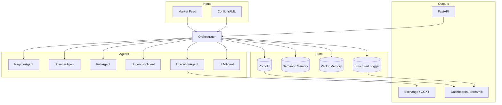

```text
███╗   ███╗ █████╗ ████████╗███████╗
████╗ ████║██╔══██╗╚══██╔══╝██╔════╝
██╔████╔██║███████║   ██║   █████╗
██║╚██╔╝██║██╔══██║   ██║   ██╔══╝
██║ ╚═╝ ██║██║  ██║   ██║   ███████╗
╚═╝     ╚═╝╚═╝  ╚═╝   ╚═╝   ╚══════╝
```

# Multi-Agent Trading Framework (MATF)

A modular, AI-native, event-driven trading framework built around autonomous agents.

## ✨ Features

- **Multi-agent architecture:** specialized agents for Regime, Scanner, Risk, Optimizer, Supervisor, and Execution.
- **AI-Native:** LLM qualitative reasoning and Machine Learning regime classification.
- **Async Event Bus:** High-performance internal communication using `asyncio`.
- **Backtester:** Realistic simulation with slippage and commissions.
- **Analytics:** Professional metrics (Sharpe, MDD) and Streamlit Dashboard.
- **Observability:** Structured JSON logging.
- **Extensible:** Plugin system for custom agents and strategies.

---

## 🚀 Quick Start

```bash
pip install -r requirements.txt
python examples/backtest_example.py
```

Launch the dashboard:
```bash
streamlit run multiagent_trading/analytics/dashboard.py
```

## 🧠 Architecture Overview



## 🛠️ Development

See [CONTRIBUTING.md](CONTRIBUTING.md) for guidelines.

## 🛣️ Roadmap

See [ROADMAP.md](ROADMAP.md).

## 📜 License

[MIT License](LICENSE).
